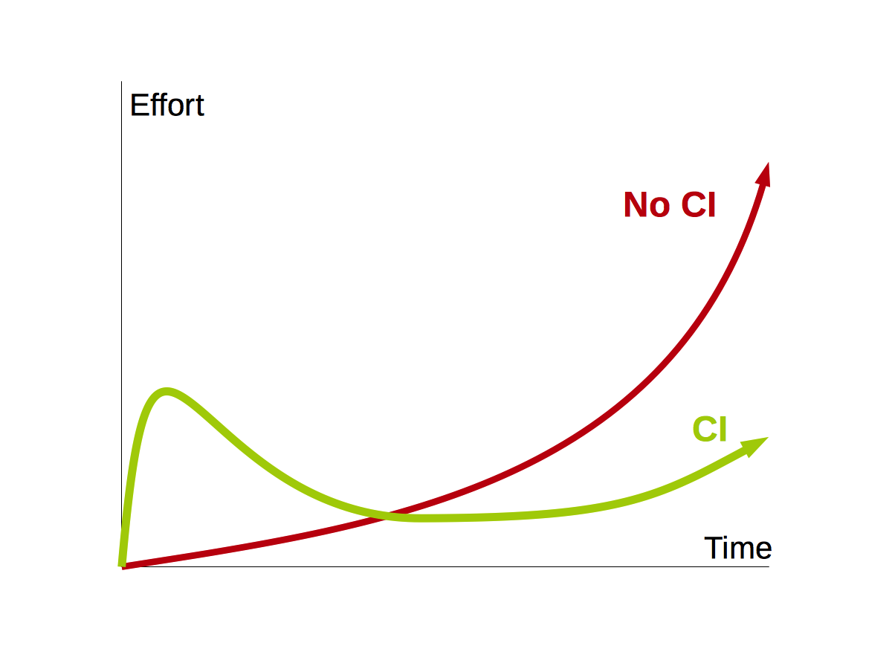
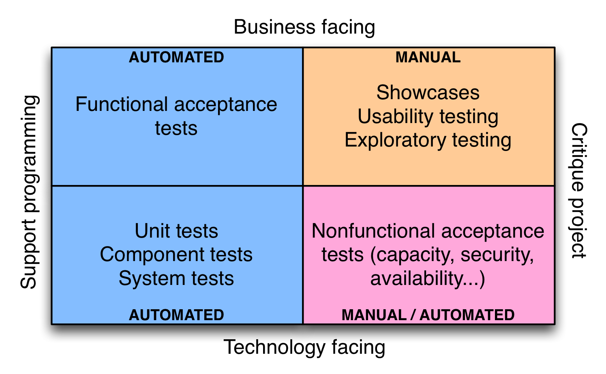

A Review of the Book _Continuous Delivery_
==========================================

This is a book by Jez Humble, one of the authors of [Accelerate](accelerate.md), in which many of the same ideas are
clearly visible in embryonic form. The basic issue that both books attempt to solve is that software "integration" is
really complex and difficult. The essence of Humble's solution to the problem is to do the integration step constantly,
thus practicing it and making it easier. _Continuous Delivery_ is a mostly technology-agnostic description of the ideal
setup enabling tech teams to realize that solution.

_Continuous Delivery_ is showing its age in 2022. Git and other distributed version control systems are mentioned only
in passing, and Python is only a footnote. Humble also mostly takes for granted that teams and computers will be
colocated. Most strikingly, the book is full of uncritical discussion of separate "dev" and "ops" teams, going only as
far as recommending that they work closely together at some key moments in the delivery process. It's hard to blame
Humble and his coauthor David Farley for this, because their book turned out to exert a huge influence on the practice
of DevOps over the past decade. Thus, I found this book pretty interesting from a historical perspective. I could see
the germ of Site Reliability Engineering and that the authors couldn't fully articulate the details of practical
solutions to the integration problem back in 2010. As I read, I considered how applicable the book's approach still is
given the ubiquity of remote work, cloud computing, and distributed version control.

If asked for a single, pithy takeaway from this read, I would probably say "don't use branches", a controversial
statement that will probably start an interesting discussion. I was surprised when I read _Continuous Delivery_'s strong
position against developing on branches, having built my career in the time of GitHub and Google Hangout. However, the
book makes a compelling case that the use of branches is unresolvably at odds with integrating changes continuously.
It's pretty intuitive: you will eventually release *one* version of your software to production, and a branch is
a *second copy* of your software that will necessarily have to be *integrated* before release.

Instead of using branches, the book's strong recommendation is to commit directly to master at least once a day.
Attempting to apply that approach right now on my current team would probably do more harm than good - trunk (the master
branch) would be broken all the time. Despite this fact, I can see the benefit of treating frequent changes to master as
the goal. Changing master while keeping it releasable forces us to integrate our changes *now* instead of later, when it
will be harder. My personal experience that the amount of integration work scales superlinearly with the size of a merge
is backed up by anecdotes from this book. This leads to a clear conclusion: over a long enough timescale, integrating
more frequently by committing directly to master and keeping it releasable requires less effort than integrating
infrequently.

That spike on the far left of the CI curve is very real. Planning a big project such that every individual step is
releasable is not a small task, but the authors strongly believe that it's possible in nearly every case. More
convincingly, they suggest in _Continuous Delivery_ and attempt to prove in _Accelerate_ that putting in this up-front
work to decompose large projects has a demonstrably positive impact on a project's cycle time (the average time
a feature takes from idea to production) in the long run.

Humble and Farley offer a few broad outlines of strategies for keeping the trunk releasable that are worth reproducing
here:

**Hide new functionality until it is finished**

At its simplest, this can be done by committing unreachable code to master. Beyond that, feature flags and canary
deployments are two common approaches to hiding in-progress functionality while simultaneously integrating and testing
it.

**Make all changes incrementally as a series of small changes, each of which is releasable**

On this point, the authors' own words are too perfect not to quote directly:

> The bigger the apparent reason to branch, the more you shouldn't branch...
> Even if turning large changes into a series of small, incremental changes is hard work while you're doing it, it
> means you're solving the problem of keeping the application working as you go along, preventing pain at the end. It
> also means you can stop at any time if you need to, avoiding the sunk cost involved in getting halfway through a big
> change and then having to abandon it.

**Use [branch by
abstraction](https://continuousdelivery.com/2011/05/make-large-scale-changes-incrementally-with-branch-by-abstraction/)
to make large-scale changes**

Essentially, this is an example of how to break down apparently non-decomposable problems into a series of steps that
can be committed individually to master.

1. Create an abstraction over the part of the system that you need to change.
2. Refactor the rest of the system to use the abstraction layer.
3. Create new classes in your new implementation, and have your abstraction layer delegate to the old or the new classes as required.
4. Remove the old implementation.
5. Rinse and repeat the previous two steps, shipping your system in the meantime if desired.
6. Once the old implementation has been completely replaced, you can remove the abstraction layer if you like.

**Decouple parts of the application that change at different rates**

The book goes into a lot of detail about the concepts of components and dependencies, but the main point as I see it is
that loosely-coupled architecture supports continuous integration.

As mentioned above, committing frequently to master without supportive process and automation in place is likely to
cause more problems than it solves in the short term. This is why the authors recommend reducing the pain of
integration not only by doing it frequently, but by automating as much of the process as possible through different
types of tests. This focus on automation mirrors Site Reliability Engineering's approach to toil reduction. Both schools
of thought acknowledge the importance of freeing up humans to do creative work by having computers do the repetitive
stuff.

The suite of automated tests should provide complete confidence that the software on trunk is fit for purpose. It's
possible to eliminate almost all types of manual tests, which means that any part of the release process that's manual
should be scrutinized for automation potential. _Continuous Delivery_ presents a taxonomy of tests based on two
independent dimensions: business/technology-facing tests, and supportive/critiquing tests.

The authors recommend organizing these types of tests in a pipeline that runs on every change to master in order of
feedback speed. Faster tests run first, and slower tests run later.

I would love to have such a comprehensive pipeline on my current team. Most of our code is covered by a reasonable set
of unit tests, but our integration, acceptance, and capacity test automation is almost nonexistent. Most data-affecting
changes I've made to our Lambda architecture have been followed by hours or days of manual testing, usually involving
eyeballing before and after trends to see if anything looks "weird". I can personally attest that this is a painful
process. The infrastructure necessary to support automating that workflow isn't simple or cheap, but the amount of time
it would have saved for me over the years is certainly huge.

One interesting point the book raises about acceptance tests, those that validate the customer-visible behavior of the
system, is that they are in effect executable specifications of that behavior. When written using a properly-abstracted
DSL, they can be read by anyone in an organization to provide an understanding of the expected behavir of the system at
that moment. The fact that they run on every commit means that they are provably up-to-date, something that's almost
never true of documentation. A general takeaway from this book is that automation is better than documentation.

_Continuous Delivery_ has some things to say about automated capacity testing, but it's the book's weakest section. It's
really hard and expensive to test the capacity of an internet-facing distributed system, because the capacity it's built
to handle is often prohibitively large. Because non-functional requirements like capacity and availability cut across
many different functional areas of the product, they are also often difficult to manage. Not paying enough attention to
these requirements at the outset and over-engineered defensive architecture are two opposite responses that can paralyze
teams. The book doesn't offer many clear solutions to this problem, but emphasizes the importance of finding a middle
path.

On infrastructure and deployment, _Continuous Delivery_ is committed to reproducibility. This is the idea that given
a commit hash on trunk, the entire environment, configuration, and application should be automatically buildable.
Autonomic infrastructure, which constantly aligns itself with a declared desired state, is a cornerstone of this
approach. At publication time, Puppet and Chef were the state of the art in the open-source community for achieving
this; today it's Terraform and Ansible. There's also a focus on smoke-tests as part of deployment automation - the
deployment script should do some basic check to ensure that it accomplished its goal.

"Configuration" is a word that comes up a lot in DevOps books, and I've had a hard time understanding exactly what it
means in context. After this read, I'm more confident: anything that can be data instead of code should be. Most
concretely to my own experience, this means that the practice of enumerating environment-specific settings in Python
files could be improved by putting them into a standard properties-file format versioned independently from the code.
The main reason to do this is that it enables creating a single deployable artifact early in the release pipeline and
reusing it on all of the pre-production environments (for unit tests, acceptance tests, user tests, etc). When
environment-specific config information is part of the code, the deployable artifact is also environment-specific,
invalidating the guarantee that what's being tested is precisely what will go to production later in the pipeline.

The hueristic I'll take with me on this point is that if there's an environment-specific constant in my code, I should
seriously consider turning it into configuration.

The book even offers a direct precursor to _Accelerate_'s delivery maturity model:

My current team's practices are mostly at level 0, with the exception of testing, which I'd consider to be regressive
due to the extensive manual testing necessary for data-affecting changes. By way of recommendation, the authors offer
a set of questions to ask when evaluating a team's maturity along these lines.

* How are you tracking progress?
* How are you preventing defects?
* How are you discovering defects?
* How are you tracking defects?
* How do you know a story is finished?
* How are you managing your environments?
* How are you managing configuration?
* How often do you showcase working features?
* How often do you do retrospectives?
* How often do you run your automated tests?
* How are you deploying your software?
* How are you building your software?
* How are you ensuring that your release plan is workable?
* How are you ensuring that your risk-and-issue log is up to date?

The rising popularity of GitHub, cloud computing, and remote work haven't undermined the relevance of _Continuous
Delivery_. The fundamental messages of **pervasive automation, comprehensive testing, loose coupling, and trunk-based
development** are as applicable today as they were in 2010. There's a blog associated with this book at
[continuousdelivery.com](https://continuousdelivery.com/).
