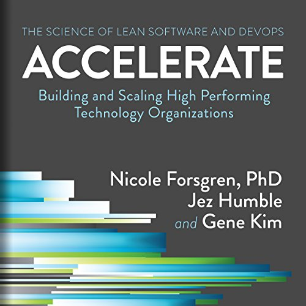

# Continuous Delivery
vs
Continuous Deployment

# A linguistic exploration

# Consensus

" _The difference between continuous delivery and continuous deployment is the presence of a manual approval to update to production\._ " ~AWS

" _Delivery always comes before deployment\, meaning that there is always a final\, manual approval step in continuous delivery before the code is released in production\._ " ~CodeMagic

" _Continuous deployment is the next step of continuous delivery: Every change that passes the automated tests is deployed to production automatically\._ " ~Puppet

" _Your Continuous Delivery process will orchestrate all of the deployment and confidence\-building/release activities which are needed\, potentially calling your Continuous Deployment infrastructure_ " ~Harness\.io

" _With continuous delivery\, ‘deploy to production’ is a manual process\, meaning that it is initiated manually\. this differs from continuous deployment\, which is automated all the way through ‘post deployment test\.’_ " ~Dzone commenter

# Nuance

“ _the purpose of continuous delivery is to make the act of deploying much less scary\._ " ~CircleCI

# Accelerate’s Taxonomic Inconsistency

" _each commit can be released to production \(a practice known as continuous deployment\)_ " p\.16

" _continuous delivery is a development practice where software is in a deployable state throughout its lifecycle_ " p\.203

" _\.\.\.test\-driven development and continuous integration\. Continuous Delivery emphasizes the importance of these technical practices_ " p\.41

# Some truths

minimizing toil involved in changing production is worth doing

there are a lot of technical prerequisites to doing this

one of those prerequisites is setting up an automated deployment pipeline

nontechnical capabilities also impact a team's delivery frequency and are worth building

# Change of Plans

Avoid both terms except when talking specifically about  __automated__  deployment

To reference  _Accelerate_ ’s list of capabilities or other more complex ideas\, use terms like “vision”\, “capability”\, or “tool”\.

